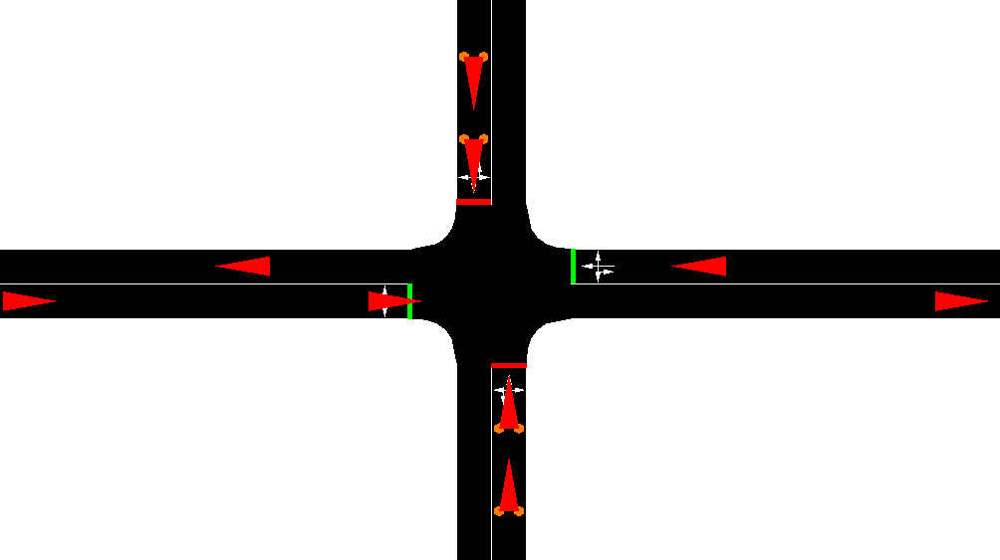

# SUMO Simulations

Run traffic simulations using SUMO (Simulation of Urban MObility).

## Prerequisites

1. Complete project setup - see [Getting Started](../README.md)
2. Install SUMO (should be done during project setup)

## Quick Start

### Interactive Mode (Manual Control)

Perfect for learning and exploring simulations visually:

```python
from sim import run_interactive

# Launch SUMO-GUI with manual control
run_interactive("simple4")
```

You'll be able to manually start, pause, and stop the simulation using the SUMO-GUI controls.

### Automated Mode (Programmatic Control)

For experiments and custom traffic control algorithms:

```python
from sim import run_automated

# Run automated simulation with TraCI control
run_automated("simple4")
```

This runs the simulation with programmatic control for 30 minutes, including adaptive traffic light algorithms.

## What's next?

**Run co-simulations with carla**: See [CARLA.md](./CARLA.md) for installation and setup instructions.

## List of Simulations

1. `simple4`



A 4-way intersection with fixed traffic lights.

Custom traffic light programs
TraCI-based control (e.g., switching between programs via traci.trafficlight.setProgram)
Basic vehicle flow and route generation

---

Coming Soon 🚧
We plan to add more scenarios, including:

- t-junction - T-shaped intersection
- complex - Grid intersection with multiple traffic sources